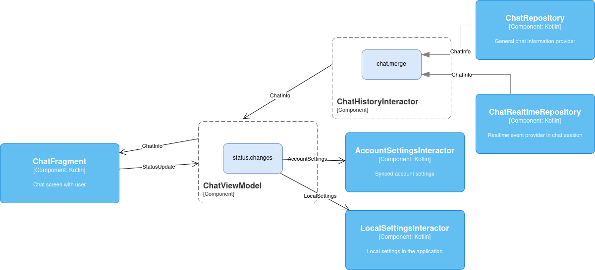

# CrossBox

[](https://kotlinlang.org/docs/ksp-overview.html)
[](./LICENCE.md)
[](https://jitpack.io/#klee0kai/crossbox)

Library for generating auxiliary template methods for models and classes.
Works on KSP.

## Getting Start

Customize the project, pull libraries to use.
Specify a repository to load the library:

```kotlin
dependencyResolutionManagement {
    repositories {
        maven(url = "https://jitpack.io")
    }
}
```

Specify libraries as project dependencies

```kotlin
plugins {
    id("com.google.devtools.ksp")
}

dependencies {
    implementation("com.github.klee0kai.crossbox:core:0.0.1")
    ksp("com.github.klee0kai.crossbox:processor:0.0.1")
} 
```

### Working with models

When used in a project, specify for which models we want to use the crossbox helper methods.

```kotlin
@CrossboxModel
data class SimpleModel(
    val name: String? = null,
    val number: Number? = null,
    val long: Long? = null,
    val short: Short? = null,
) {
    companion object;
}
```

tools for merging and comparing models are now available to us

```kotlin
val oneSourceModel = SimpleModel(
    name = "name",
    number = 1,
)
val secondSourceModel = SimpleModel(
    long = 2,
)
val merged = oneSourceModel.merge(secondSourceModel)
```

As well as methods for comparing models across fields

```kotlin
val oneSourceModel = SimpleModel(name = "name", number = 1)
val secondSourceModel = oneSourceModel.copy(number = 2)

oneSourceModel.changes(
    changed = secondSourceModel,
    nameChanged = {
        // do smth
    },
    numberChanged = {
        // do smth
    }
)
```

In architecture template methods can be used for example when merging data from different sources.
And also when changing states in different storages



Working with classes
With the crossbox library you can create proxy implementations of your classes to make your classes synchronous,
or measure the performance of methods in a class.

```kotlin
@CrossboxGenInterface
@CrossboxSuspendInterface
@CrossboxAsyncInterface
@CrossboxProxyClass
open class GreetingClass : IGreetingClass {

    override val greeting: String = "Hello, World!"
    override var person: String = "Andrey"

    override fun sayHello() {
        println(greeting)
    }

    override suspend fun sayGoodbye() {
        println("Goodbye")
    }

}
```

```kotlin
val greetingClassProxy = IGreetingClassCrossboxProxy(
    crossboxOrigin = GreetingClass(),
    crossBoxProxyProcessor = SynchronizedProxy(),
)

greetingClassProxy.sayHello()
```


The library allows you to create asynchronous interfaces based on your. 
Realize all asynchronous work with via adapter.

```kotlin
val greetingClassAsync = IGreetingClassToAsync(
     crossboxOrigin = GreetingClass(),
     crossboxScope = CoroutineScope(SupervisorJob()),
)
greetingClassAsync.sayGoodbye().join()
```

## License

```
Copyright (c) 2025 Andrey Kuzubov
```
